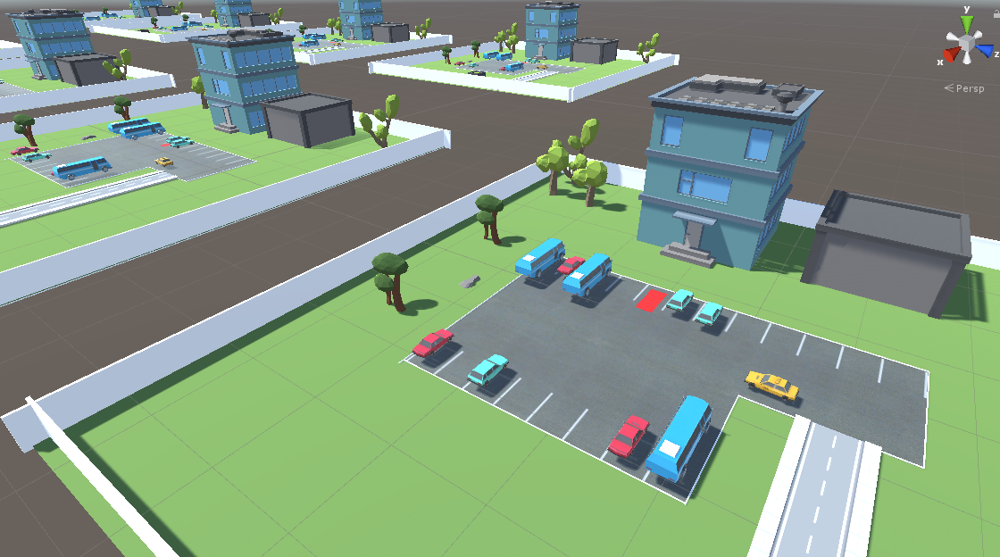
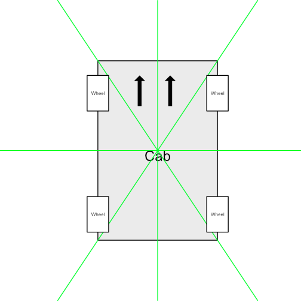

# Car-AI-Unity
This projects aims to simulated a parking-scenario in which a cab has to find an appropriate parking slot in a given time window and at best without hitting other obstacles. This projects was implemented using unity and its amazing feature ml-agents.

## Prerequisites
- unity hub
- unity v2019.2.11f1

## Getting Started
- usual unity-flow

## Motivation
This project was created to implement a reinforcement learning-approach using unity.
Other high-level categories of ai like supervised- or unsupervised learning can be demonstrated using some simple scripts, while testing reinforcement learning is not that easy. In addition to that, reinforcement learning offers some nice possibilities to be visualized inside a digital world and with the ml-agents-api of unity its quite nice to see the results.

## High-level concept
The main goal of this project is 1st to spawn a cab, 2nd which has to find an appropriate parking slot and 3rd has to park there 4th at best without damaging other cars. To archieve this, this car is equiped with 8 sensors, which can be seen at the following image.

    

This sensors measure the distance to the next obstacles. This information is send to the underlying ai.
Then a parking simulation is introduced with other cars and a parking slot (red). According to a so called reward-function (reinforcement learning) the car gets a positiv/negativ reward according to its actions. The reward-function emits a high negativ reward if the cab hits other cars, a low negativ reward if it hits some random obstacles or a high positiv reward if it parks at the parking slot. With the given sensors the car has to figure out to not hit other obstacles and is forced (to archive best loss of reward-function) to find the appropiate parking slot. The scence is replecated multiple times and resets each approx. 20s.

## Story time
There are a lot of small stories connected with this simulation, especially because there are and there were a lot of errors implemented by me (e.g. the reward-function).
- the classic: after some training the car searched the next wall and drives against that wall the whole time
    - reason (likely): According to the configuration the car must drive. If it hits another car it gets a high negativ award, if it hits a wall it gets a low negativ award. So i guess it leaned that "drive against wall" is better than probably hit some cars -> i hope you see the point
- At some point of the training, it managed to crash into another car after reseted every time. It crashed into that car in a very specific angle so that the wheel was lifted and could continue to drive
    - reason (likely): The reason is somehow like described above. The ai probably checked that if it hits that car in that angly it gets a high negativ award at first, but after that, it get no negativ award at all! -> i hope you get point

The reward-function is very tricky to fine-tune. But if you fail, i mean, its fun too, isnt it.

## Important Scripts
The given projects contains some really important scrips some of them are listed below.
- simpleCarController1.cs
    - responsible for the control of the cab
- parkingAcademy.cs
    - represents the learning environment in the context of unity ml-agents
- parkingAgent.cs
    - ML-Agent to process the learning stuff
    - communicates with the parking academy

## Build with
- unity hub
- unity v2019.2.11f1
- unity ml-agents v0.10 / v0.11

## Acknoledgements
- Thanks [Samuel Arzt](https://www.youtube.com/channel/UC_eerU4SleeptEbD2AA_nDw) for the motivation to introduce some ai-concepts to unity especially with [this](https://www.youtube.com/watch?v=VMp6pq6_QjI&ab_channel=SamuelArzt) one.
- Thanks [EYEmaginary](https://www.youtube.com/channel/UCNNLI9QPXU5wQUUsfDG6n6w) for the good introduction to the whole topic through [this](https://www.youtube.com/watch?v=o1XOUkYUDZU&ab_channel=EYEmaginary) series for example.
